--- 
title: "Week 1: Set Up Your AI‑Course Portfolio Website" 
format: 
  html:
    toc: true
    number-sections: true
author: "The Graph Courses"
---

## Overview {.unnumbered}

Welcome to your first hands-on workshop! This guide will walk you through creating an AI-Course Portfolio Website where you will show off the work you create in the course.

By the end of this session, you'll have a live, professional website which you will populate with your work each week.

The steps in this guide, and the way we publish the site, are all meant to be accessible for free. A free Gemini account is enough, and GitHub Pages will host the site at no cost.

To see what your portfolio might look like by the end of the course, review:

-   [Buntu's portfolio](https://buntumalunga.github.io/graph-ai-portfolio/){target="_blank"}

-   [Gbenga's portfolio](https://gbengasaolu.github.io/graph_courses_aiw/){target="_blank"}

### What You'll Learn {.unnumbered}

Through this workshop, you'll gain practical experience with:

-   Using AI (ChatGPT, Gemini, or another LLM chat tool) to generate professional web content
-   GitHub for code hosting and version control
-   GitHub Pages for free website deployment
-   Basic HTML structure and web development concepts

Let's get started!

# PART 1: Creating the Site

## Give the AI model the course information and your CV and ask it to build a portfolio website

-   Download the course brochure from [thegraphcourses.org/aiw](https://thegraphcourses.org/aiw){target="_blank"}.

-   Locate a recent version of your CV, either as a PDF or a Word document. We will be using this to populate the "About me" section of the website.

::: {.callout-note}

**Side Note:** If you are very private and don't want a public website with your info online, you can use a pseudonym or use a random sample CV from the internet. e.g. [this one](https://careercenter.ucdavis.edu/sites/g/files/dgvnsk15461/files/media/documents/AES-Agriculture-and-Plants.pdf){target="_blank"}
:::

-   Use [ChatGPT](https://chatgpt.com){target="_blank"} if you have a paid account. Free ChatGPT does not allow enough file uploads for this task. If you do not have paid ChatGPT, use [Gemini](https://gemini.google.com){target="_blank"}. A free Gemini account is enough.


::: {.callout-note}

**Side Note:** You can also use Claude, Copilot, DeepSeek, or another chat tool. The steps and screenshots in this guide are written for ChatGPT and Gemini, so they will not match those other tools exactly. You will need to transpose the steps yourself.
:::

-   **If you are using Gemini:** Before typing your message, click on the "Tools" button and select "Canvas" from the dropdown menu. This lets Gemini render your HTML as a live preview.

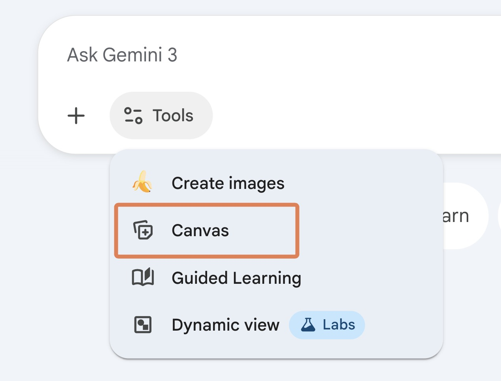{width="297"}

-   Now, start a new message, then upload the course brochure **and** your CV to the chat window, and create an instruction similar to this:

    ```         
    Build an elegant one‑page portfolio website for my "Generative AI for Work & Research" course.

    Use the course information and my CV, which are given below. The site should have at least the following sections:

    - About me
    - About the course
    - My weekly submissions (These can be placeholders for now, we will add links to each submission later on)

    Render the HTML in a canvas so I can preview the live page.

    Try to write simply and minimally, and mostly use text that already exists in the source materials.

    Don't use frameworks.

    Don't include my email in the site to avoid spam
    ```

-   Use Enter or click the "Send" button to send the prompt to the model.


## Preview the page and refine

-   ChatGPT or Gemini should reply with the HTML and a live preview of the page.
-   If the website is not displayed, look for a preview control and open the live view. On Gemini this is the `Preview` button on the canvas.

## Model the site on an existing design (optional, recommended)

The AI models tend to produce the same kind design every time. This gives a generic look that is sometimes called 'AI slop'. And it makes people tune out your website, because they assume it is low effort. 

It is therefore better to start from a design a person with good taste already made.

-   If you have already built a website you like, or if you have design skills, you can use screenshots of your work or custom instructions to give the model design inspiration.

Otherwise,  we recommend borrowing a theme from designers who have created and shared freely available work online. One good place to find such free designs is the Hugo gallery. Let's try that.

-   Go to [themes.gohugo.io](https://themes.gohugo.io/){target="_blank"} and browse through the themes to find one you like.
-   Take a screenshot of the hero, which is the large preview at the top of the theme page.

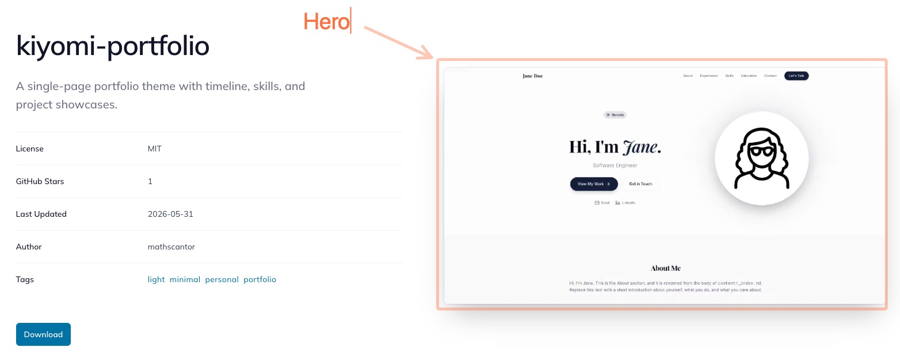{width="620"}

-   Also copy the URL of the theme page and the author info box on the same page (license, author, and the other details). It should look something like this:

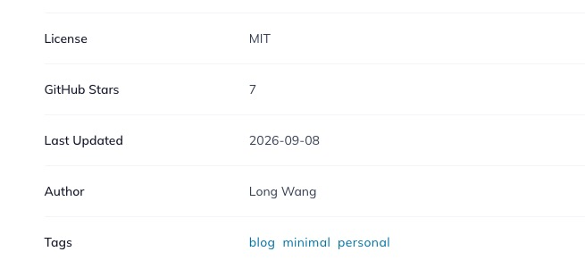{width="480"}

-   Back in your chat, upload the hero screenshot and paste the URL and the author info. Ask the model to restyle your page after that design a bit, and to add a short citation at the bottom. A prompt like this works:

    ```         
    Restyle my portfolio so it takes some inspiration from this design.
    I have attached a screenshot of the hero.

    Keep my existing content.

    Add a short citation at the bottom crediting the theme and its author. Here is the information for citation: 
    [URL of the theme page]
    [Author information]
    ```

The model will not always reproduce the design exactly. More expensive paid models are usually better at this. Even so, the page is usually better than the design the model would have produced on its own.

-   You can still ask for smaller changes after that. For example, change accent colors, or change specific pieces of text.

::: {.callout-note}

**Side Note:** If you know some basic HTML, you can click the edit button at the top right of the preview and edit the HTML directly. On Gemini this button is on the canvas. 
:::

## Copy the HTML code

The next step is going to be to try to get this HTML code to an online hosting service, so that it can be viewed by others.

-   Switch from the preview back to the code so you can copy it.
    -   On Gemini, click the `Code` button at the top right of the canvas.
    -   On ChatGPT, click the `Stop` button, or open the code view, to see the HTML.
-   Select all the HTML inside the code box then copy it with `Ctrl/Cmd+C`.


::: {.callout-note}

**Side Note:** Paid ChatGPT now includes ChatGPT Sites on some plans, which lets you publish a webpage from inside ChatGPT. It's a beta feature, it's only the paid plan, and we're not sure how reliable it will be for the long term, so we don't use it here.
:::


## Create a GitHub account (one‑off)

Github is a platform for hosting and collaborating on code. It is one of the most generous and reliable platforms for freely hosting static websites. We will use it to host your portfolio website. - Visit [github.com](https://github.com){target="_blank"} → click **Sign up** and follow the steps.

## Make a new repository

-   Click the `＋` icon (top‑right) → **New repository**.

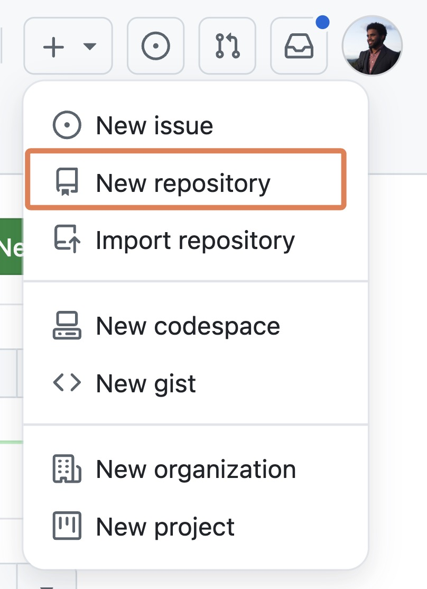{width="201"}

-   Name it `graph-ai-portfolio` (or something similar).
-   Make sure the visibility is set to **Public**, and leave every other setting with the default values. Click **Create repository**.

## Add your HTML file

-   Inside the GitHub repo you created, find the button to "create a new file" and click it.

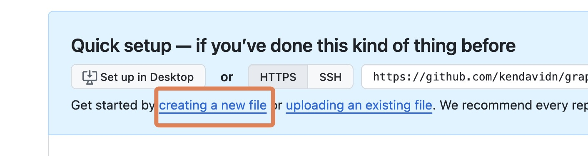{width="473"}

-   Type `index.html` in the filename box, lowercase with no spaces.

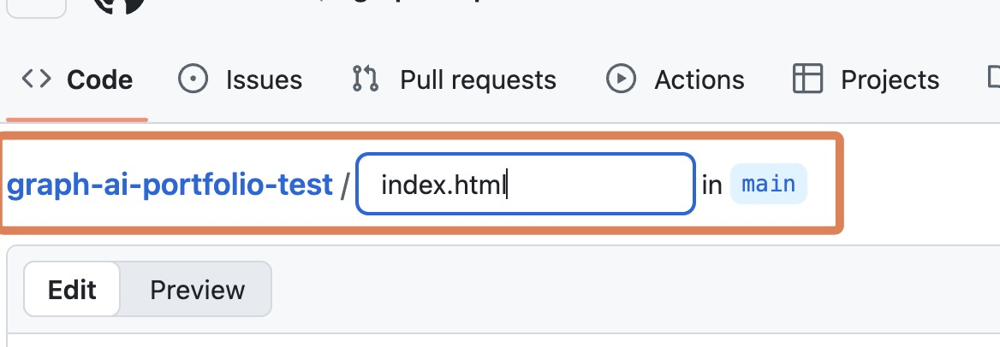{width="389"}

-   Paste the HTML you copied from your LLM into the main code box below the file name, where it says "Enter file contents here".

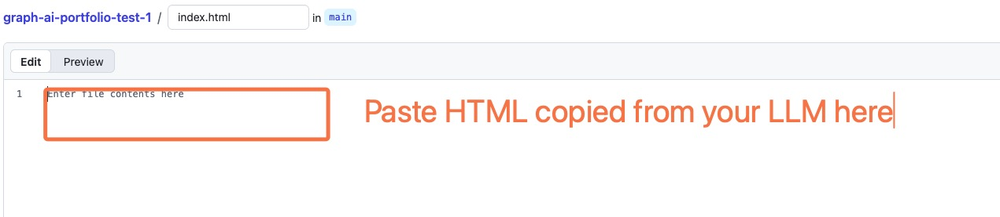{width="550"}

-   At the top right, click the **Commit changes** button.

Congratulations! Your website has now been added to GitHub, which will host it to make it accessible to the world. We need one more step to make it live: turning on GitHub Pages.

## Turn on GitHub Pages

-   Go to **Settings** button at the top right of your repository page.

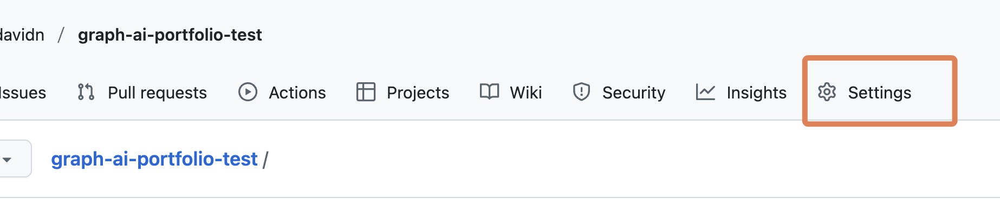{width="495"}

-   In the left sidebar, click **Pages**.
-   Under "Branch", click the dropdown menu that should say "None" and change it to **main**
-   Click **Save**. Wait \~1 minute.

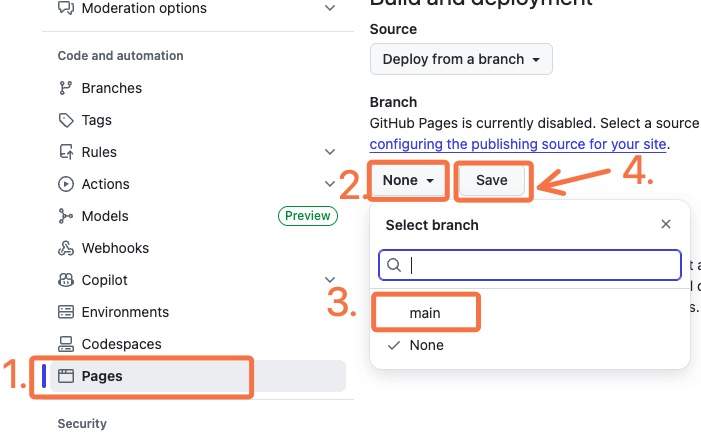{width="500"}

-   You can then click on the "Actions" tab then "pages build and deployment" to see the build process.

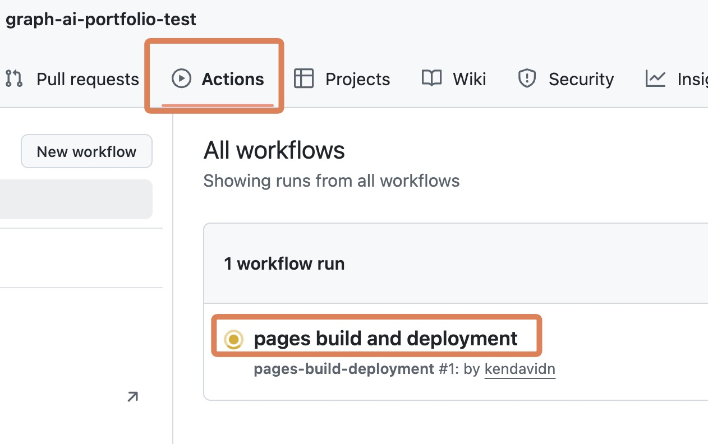{width="361"}

-   After a minute or so, your site should now be live at the URL on the pages-build-deployment page.

# PART 2: Making Changes to the Site: Adding a profile picture

While most of the webpage can be directly represented by the text in the index.html file you obtained from the LLM, images are bit more complicated.

You typically need to host the image with a special platform, obtain a link to it, and then add that link (or ask an LLM to add it) to the index.html file.

In this section, we will add a profile picture to your website.

## Add a profile picture to GitHub

-   To get back to your repository home, again visit github.com, click on your profile at the top right, then click on "Your repositories"

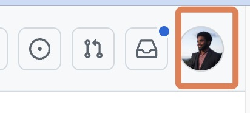{width="174"}

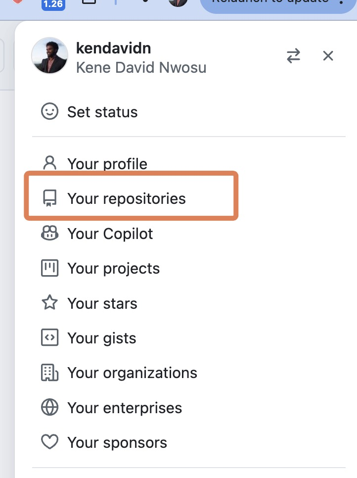{width="229"}

-   Locate and click on your repository, which should be called something like `graph-ai-portfolio`

-   Locate the button or icon to "Add file". Click on it and select "Upload file"

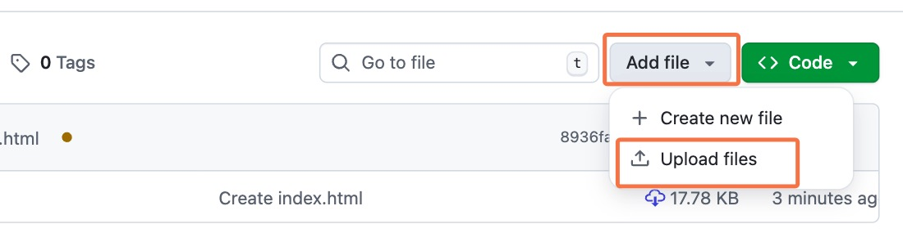{width="473"}

-   Drag your profile picture into the box, then click on "Commit changes"

-   Click **Commit changes**.

-   Now click on the name of the uploaded image file to open it.

-   Then right-click on the image, a menu will appear. Select "Copy image address". Now you have a link that can be embedded in the index.html file!

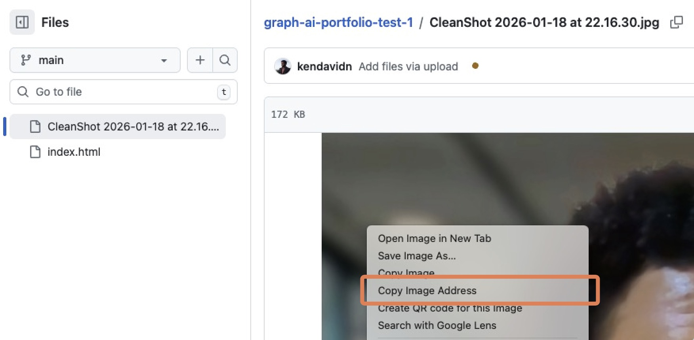{width="442"}

-   Back in your chat tool (ChatGPT or Gemini), paste the image address into the prompt and ask the model to insert the image. Your prompt might look something like this:

    ```         
    Insert this image of me at the top of the page as a circular avatar.
    The image is at this address: [LINK TO YOUR IMAGE HERE]
    ```

-   Copy the new HTML that the model generated → return to your *index.html* on GitHub → click the **edit file** (✎) button at the top right.

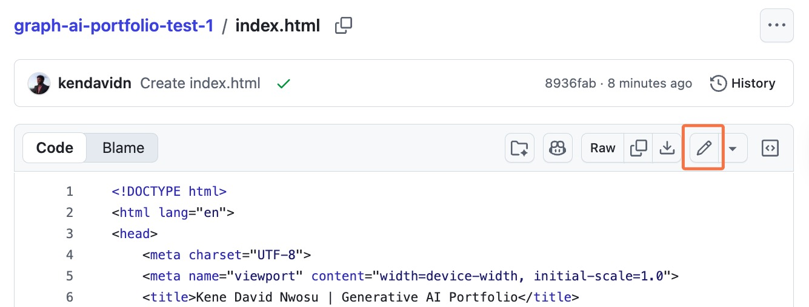{width="550"}

-   Delete all the existing code in the file, then paste in the new code.

-   At the top right, click the **Commit changes** button.

-   Go again to Actions, and click on the latest build to observe the build process. Your live site, if refreshed, should now have the avatar!

## Submitting your work

You will submit two things:

-   The link to your live site. This should be something like `https://yourusername.github.io/graph-ai-portfolio/`. YOu will paste this as a comment on the workshop page.
-   The index.html file. To download it, go to the GitHub repo, click on the **index.html** file. Locate the download button or icon in the top right corner. Click it to download the file. You will upload this to the workshop page.

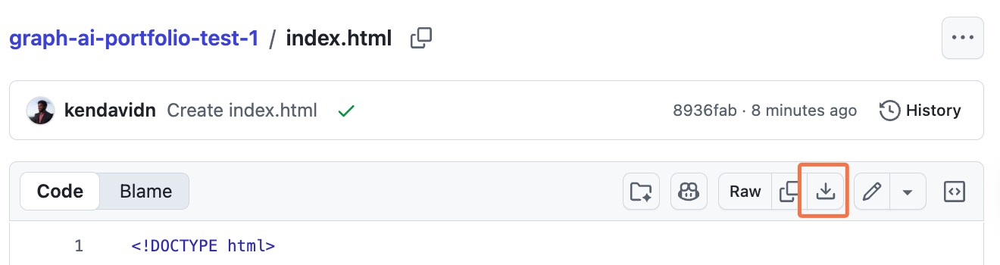{width="550"}