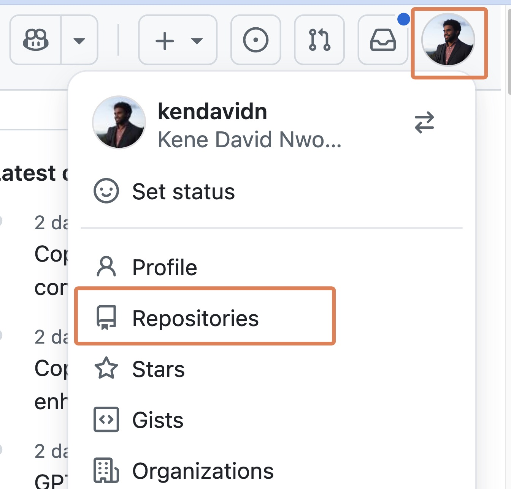
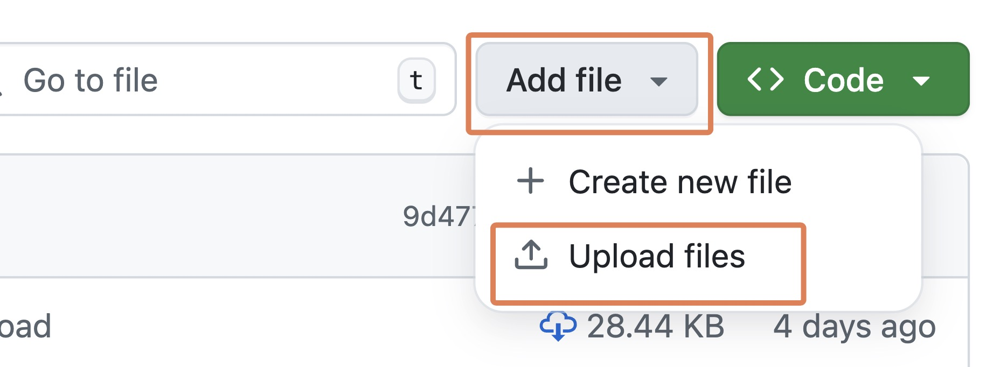
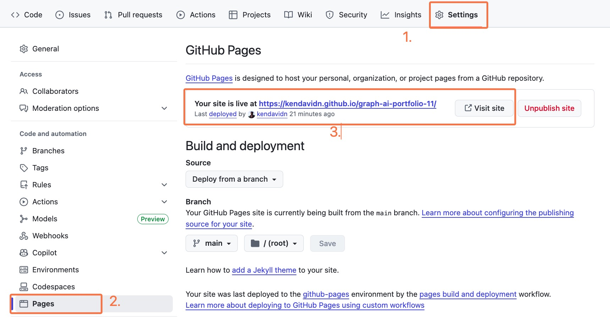
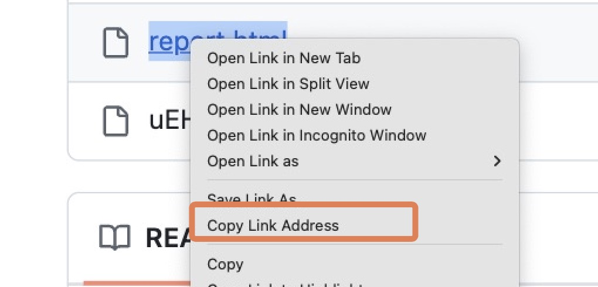
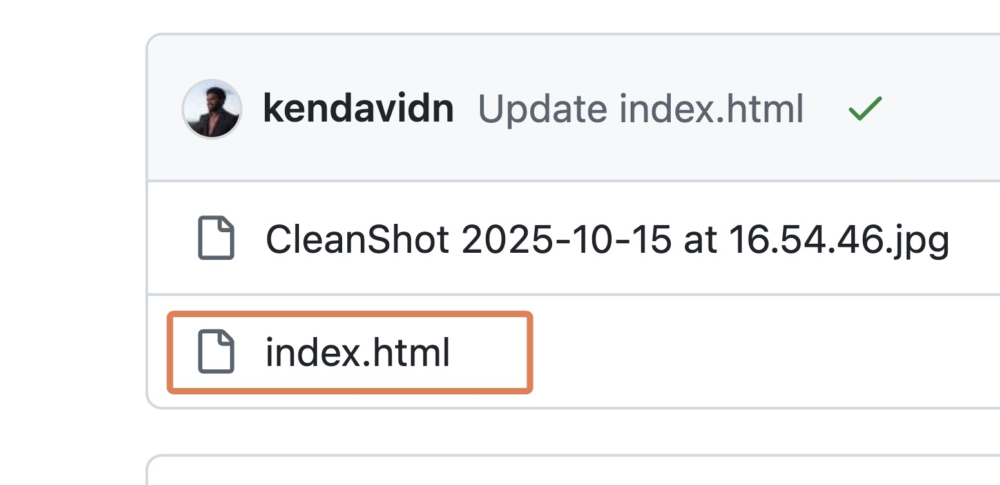
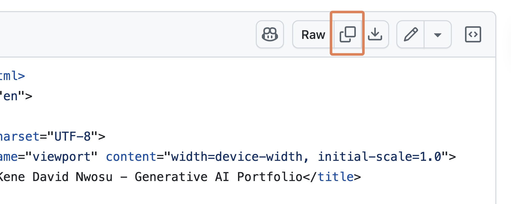
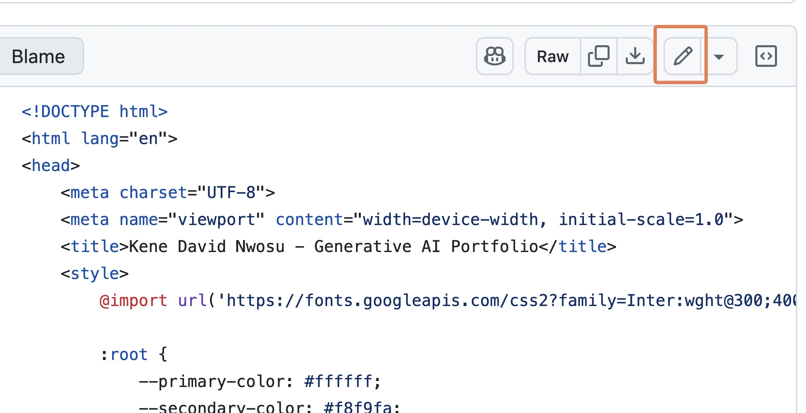
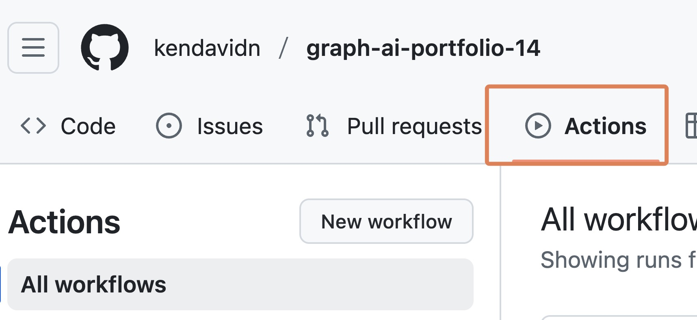
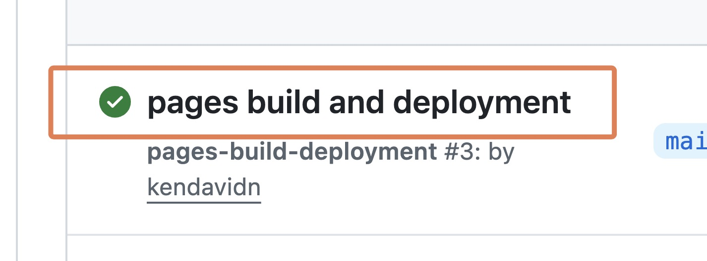

# Introduction

Welcome! In this assignment, you'll use Large Language Models (LLMs) directly within Google Sheets to extract specific information from hundreds of data analysis job postings. (This is the kind of analysis that we do at Graph Courses to inform our course offerings.)

::: {.callout-note}

**Side Note:** The assignment will require using some snippets of code. Do not recoil from this, even if you are not a programmer. Because AI tools work primarily with code, you will maximize your use of these tools if you are not scared of working with code once in a while. Most of the time, the AI's themselves can help you generate the code you need. For example, the MYGPT function code was generated with the help of some LLM models.
:::

Afterwards, you'll take this extracted data and use an AI-powered analysis tool (ChatGPT or Cursor, based on your experience from the previous workshop) to create visualizations and a concise report.

## Prerequisites

1. **Review the Pre-work:** This assignment assumes you have reviewed the pre-work, which covers setting up and using LLMs in Google Sheets with OpenRouter. If you haven't, please briefly review the video here: [Using LLM APIs with OpenRouter and Google Sheets](https://vimeo.com/1086807545?share=copy&fl=sv&fe=ci){target="_blank"} to ensure you have the necessary context. You don't have to code/type along with the video; a brief review is enough.

    - If the video mentions `google/gemini-2.5-flash-preview`, use `google/gemini-2.5-flash` instead. The preview model is no longer available on OpenRouter.

2. **For Non-English Locales:** If your Google account is set to any language other than English, please set Google Sheets to display function names in English so you can follow along with this lesson.

    - When you open a new spreadsheet, click `File` at the top left and then `Settings`.
    - Under 'Display language', make sure the box 'Always use English function names' is checked/ticked.

Then come back to this assignment.

## Your Final Report Structure

Your submitted report for this assignment should include the following sections:

1.  A brief introduction (1-2 sentences) describing the data and the project's aim.
2.  Analysis of "Years of Experience" (including a visualization and your interpretation).
3.  Analysis of "Programming Language Requirements" (including a visualization and your interpretation).
4.  A personal reflection on the process (see details in Part 2).

(In your interpretations, be sure to note the limitations of the small sample size.)

------------------------------------------------------------------------

# Part 1: Data Extraction in Google Sheets

You will begin by setting up Google Sheets to call an LLM API to extract specific information from job descriptions.

## Part 1A. Setting Up Your Google Sheet

1.  **Get the Data:**

    -   The dataset for this assignment is a CSV file of Data Analyst job postings: [data_analyst_postings_sample.csv](https://github.com/the-graph-courses/aiw_2026_t3_materials/blob/main/week_03_workshop/data/data_analyst_postings_sample.csv){target="_blank"}. There is a download icon at the top right of the file

    Screenshot: {width="200px"}.

    -   (This data was originally scraped from Glassdoor in June 2020. The scraping project and full dataset can be found here: [Original Data Source](https://github.com/picklesueat/data_jobs_data){target="_blank"})

2.  **Import Data into Google Sheets:**

    -   Create a new Google Sheet and give it a name like "Data Analyst Job Market Analysis". (You can quickly create a new sheet by going to "sheets.new" in your browser.)
    -   Go to `File → Import`.
    -   In the Import file dialog, select the `Upload` tab.
    -   Drag the downloaded `data_analyst_postings_sample.csv` file into the upload area. The default import settings should be fine.
    -   **Adjust Row Height (if needed):** If the rows are too tall due to long job descriptions, select all cells (press Ctrl+A or Cmd+A two times), then move your mouse to the divider line between any two row numbers on the left (e.g., between row 1 and row 2). Your cursor will change. Click and drag the divider upwards to resize all selected rows.

3.  **Set Up Your API Key:**

    -   In your Google Sheet, choose an empty cell that's out of the way (e.g., `M2`). Paste your personal OpenRouter API key into this cell.

4.  **Add the `MYGPT` Apps Script Function:**

    -   Go to `Extensions → Apps Script`.
    -   Replace any starter code in the editor with the exact snippet below:

    ``` javascript
    function MYGPT(prompt, model, key) {
      if (!prompt) return '';
      if (!model) throw new Error('Model ID required (e.g. "google/gemini-2.5-flash").');
      if (!key) throw new Error('OpenRouter API key required.');

      const url = 'https://openrouter.ai/api/v1/chat/completions';
      const body = {
        model: model,
        messages: [{ role: 'user', content: String(prompt) }]
      };

      const options = {
        method: 'post',
        contentType: 'application/json',
        headers: { Authorization: 'Bearer ' + key },
        payload: JSON.stringify(body),
        muteHttpExceptions: true
      };

      try {
        const res = UrlFetchApp.fetch(url, options);
        const json = JSON.parse(res.getContentText());
        if (json.error) { // Check for API errors returned in JSON
          return 'GPT error: ' + json.error.message;
        }
        return json.choices[0].message.content.trim();
      } catch (err) {
        return 'GPT error: ' + err;
      }
    }
    ```

    -   Click the "Save project" icon (💾).
    -   Click "Run" once. Google will ask you to authorize the script. Follow the prompts to allow it. You might see a "This app isn't verified" warning; you can proceed by clicking "Advanced" and then "Go to (your project name)".
    -   You may need to go through the authorization process more than once. You will know it has worked when you see "Execution completed" after pressing "Run".

## Part 1B. Extracting Years of Experience Required

You'll use the LLM API to find the minimum years of experience mentioned in the `Job Description` column.

1.  **Create New Column:** In your sheet, find the first empty column to the right of your data. Add a header like `Minimum Years Experience`.

2.  **Formulate the Prompt & Apply `MYGPT`:**

    -   We will use the `google/gemini-2.5-flash` model.
    -   Assuming your first job description is in cell `C2` (adjust if it's in a different column for your imported data) and your API key is in cell `M2` , the formula in the first cell under your `Minimum Years Experience` header would be:

    ```
    =MYGPT(CONCATENATE("Extract the minimum years of experience required from this job description. Return ONLY a number. If a range is given, return the lower number. If no years of experience are explicitly mentioned, return 'NA'. Here's the job description: ", C2), "google/gemini-2.5-flash", $M$2)
    ```

    -   Test this on a few rows (e.g. 2-5) and manually verify that the outputs are reasonable.

3.  **Apply to All Rows:**

    -   Once you have tested the formula on a few rows, drag the fill handle (the small square at the bottom-right of the selected cell) down to apply it to all job descriptions. This will make an API call for each row, so it might take a moment.

4.  **Lock in Results:** Once the LLM has processed the column and you have the results:

    -   Select the column of results and copy them (Ctrl+C or Cmd+C).
    -   Right-click on the column header again, then `Paste special → Values only`. This converts the formulas to static text, preventing accidental re-runs and saving API costs.

## Part 1C. Extracting Programming Language Requirements

Next, you'll ask the LLM to identify what programming languages are mentioned as being required in the job descriptions. In particular, we want to know whether R, Python, both or neither are mentioned.

1.  **Create New Column:** Add another new column with a header like `Data Languages`.
2.  **Craft Your Own Prompt:**
    -   For this task, you need to write the prompt yourself.
    -   Your prompt must clearly instruct the LLM to analyze the `Job Description` and return **ONLY one of these four specific strings** based on the data programming language requirements in the job description: R, Python, Both, or Neither.
    -   **Hint:** Be very explicit. A good prompt will state the options clearly and tell the model to choose only one.
3.  **Apply `MYGPT` Function:**
    -   Use your crafted prompt with the `MYGPT` function, similar to Task 1, concatenating it with the relevant job description cell (e.g., `C2`) and using `google/gemini-2.5-flash` and your API key reference (e.g., `$M$2`).
    -   Apply to a few rows first to validate that the model is doing what you want, then to all rows.
4.  **Lock in Results:** Again, once processed, select all cells with results in your `Data Languages` column, copy them, and then paste special as values only.

::: {.callout-note}

**Side Note:** An interesting question at this point is "Is an LLM needed just to extract R and Python? Can't I just use a simple text search?" While this would work for Python, it would not work for R, unfortunately. 

The challenge is that "R" is an extremely common letter in English text. A simple text search for "R" in job descriptions would return a lot of false positives like "R & D (research and development)", "H R (human resources)", "RA (research assistant)" and others. An LLM is more robust because it understands context, allowing it to accurately distinguish between what capital R means in "R programming" and what it means in "HR department".
:::


------------------------------------------------------------------------

# Part 2: Reporting with AI Tools (ChatGPT or Cursor)

Now that you've extracted data in Sheets, you'll use an AI tool for visualization and reporting.

Ensure your Google Sheet has the original `Job Description` and `Median Salary Estimate` columns, plus your newly created and value-pasted `Minimum Years Experience` and `Data Languages` columns.

Next, in Google Sheets, go to `File → Download → Comma Separated Values (.csv)`. Save this file to your computer.

Choose the same type of tool track you used in Workshop 2:

-   **Students WITHOUT significant coding experience:** Use **ChatGPT**, a user-friendly AI chat tool with data analysis capabilities.
-   **Students WITH coding experience:** Use **Cursor**, an AI-assisted code editor.

Your goal is to create a report document that includes:

-   A brief introduction (1-2 sentences) describing the data and project.
-   **Years of Experience Analysis:** A scatter plot of `Minimum Years Experience` (x-axis) vs. `Median Salary Estimate` (y-axis), plus a brief interpretation.
-   **Programming Language Analysis:** A box plot of `Median Salary Estimate` grouped by `Data Languages`, plus a brief interpretation.
-   **Reflection:** A short reflection (e.g., 1-2 paragraphs) written by you (not the AI). Consider what was easy or difficult, what was surprising, and what you learned.

## Section A: For Students WITHOUT Prior Coding Experience (Using ChatGPT)

You will use ChatGPT to analyze your downloaded CSV and generate content for your report.

1.  **Set up ChatGPT:**
    -   Go to [chatgpt.com](https://chatgpt.com/){target="_blank"} and sign in.
    -   Select the **thinking** model, as in Workshop 2. This model handles multi-step data analysis tasks more reliably than the instant model.
    -   If you do not have access to the thinking model, share your email address with one of the instructors and we will add you to our workspace for one month so that you can complete this workshop.
2.  **Start your analysis:**
    -   Start a new chat in ChatGPT.
    -   Upload your downloaded CSV file. You can drag and drop it in, or use the attachment button near the chat input.
3.  **Prompt ChatGPT:**

    ```
    I have uploaded a CSV file with data from Data Analyst job postings.

    It should include columns like:
    - "Median Salary Estimate"
    - "Minimum Years Experience" (numeric, but may include "NA" or non-numeric text if extraction failed)
    - "Data Languages" (categorical: R, Python, Both, or Neither)

    Please help me create the required visuals. 

    Create:
    1. A scatter plot of "Minimum Years Experience" on the x-axis vs. "Median Salary Estimate" on the y-axis.
    2. A box plot of "Median Salary Estimate" grouped by "Data Languages".

    ```

4.  **Review and refine:** ChatGPT will show its steps, data, and plots. Work with it to refine the figures and text until you are happy with the output. For example, you can ask it to change a plot title, improve the axis labels, or use a different color scheme.
5.  **Create your report document:**
    -   Download the plots as images or take screenshots of them.
    -   Copy the relevant text outputs from ChatGPT.
    -   Assemble the introduction, plots, interpretations, and your own reflection in Word, Google Docs, Pages, or another word processor.
    -   Export the final document as a PDF.

## Section B: For Students WITH Coding Experience (Using Cursor)

You will use Cursor to generate a coded report.

1.  **Set up your project:**
    -   Create a new project folder on your computer.
    -   Put your downloaded CSV file in that folder.
    -   Open the folder in Cursor.
2.  **Create your report file:**
    -   Create a new R Markdown (`.Rmd`) or Quarto (`.qmd`) file.
    -   Use Cursor's Agent Mode to help you write the code and narrative.
3.  **Prompt Cursor:**

    ```
    You are an AI agent that creates data reports.
    - You create reports by writing code to an R Markdown or Quarto file, rendering that file, then reading the output to validate your work.
    - You repeat this edit, render, review loop until the reporting task is achieved.
    - Use plots, tables, and inline code where appropriate.
    - Code should be hidden from the output.

    Now, I have added a CSV which contains data from Data Analyst job postings. It contains columns like "Median Salary Estimate", "Minimum Years Experience" (numeric, may contain "NA" or non-numeric text if extraction failed), and "Data Languages" (categorical: R, Python, Both, or Neither).

    Help me generate a report with:
    - A scatter plot of "Minimum Years Experience" vs. "Median Salary Estimate".
    - A box plot of "Median Salary Estimate" grouped by "Data Languages".
    - A brief introduction and interpretation of each plot, noting the limitations of the small sample size.

    I will add my own personal reflection.
    ```

4.  **Review, refine, and render:** Work with Cursor to refine the report, then render it to a single HTML or PDF file. Before your final render, add your short reflection written by you, not the AI.

## Side Note: Why This Multi-Step Process?

You might wonder: "Why not just upload the original, raw CSV of job postings directly into ChatGPT or Cursor and ask it to do everything?"

While powerful, LLMs and AI tools have limitations, especially with large, unstructured inputs:

-   **Context Window Limits:** LLMs can only process a certain amount of text (the "context window") at once. A large CSV with many long job descriptions can easily exceed this limit. The model might then ignore parts of your data or fail to process it comprehensively.

-   **Focus and Accuracy:** Asking an LLM to perform many complex tasks (like reading hundreds of descriptions, identifying specific data points within each, cleaning them, and then visualizing) all from one massive, raw input can lead to confusion, errors, or "hallucinations." The model might struggle to keep all instructions and data points straight.

------------------------------------------------------------------------

# Part 3: Submission

-   **What to Submit:** Your final report as a **single PDF or HTML document**. This PDF or HTML should include all the sections outlined at the beginning: Introduction, Years of Experience Analysis (plot & interpretation), Programming Language Analysis (plot & interpretation), and your AI Reflection.
-   **You don't need to submit your Google Sheet.** That is for your own work.

------------------------------------------------------------------------

# Part 4: Optional - Add to Your GitHub Pages Portfolio

As a final step, you can add your report to your portfolio website which you created earlier in the course.

## Upload Your Report to GitHub

-   To get back to your repository home, visit github.com, click on your profile at the top right, then click on "Repositories"

    {width="324"}

-   Locate and click on your repository, which should be called something like `graph-ai-portfolio`

-   Locate the button or icon to "Add file". Click on it and select "Upload file"

    {width="459"}

-   Drag your final report file (HTML or PDF) into the box, then click on "Commit changes"

## Update Your Portfolio with ChatGPT or Gemini

-   Go to ChatGPT or Gemini and start typing a prompt like the one below. The parts in square brackets will need to be filled in with information you'll gather in the next steps.

    ```         
    I want to update my portfolio website. In your response, you will provide the FULL updated HTML code for the index.html file.

    The portfolio website is hosted at 

    [YOUR PORTFOLIO WEBSITE URL HERE].

    ---

    I want to add a new link for the project page for "Workshop 3: Job Market Data Analysis".

    For this project, I used LLMs in Google Sheets to extract information from job postings, then analyzed the data with AI tools to explore relationships between experience requirements, programming languages, and salaries.

    The report is available at the link below. (If the link is a PDF file, then we will embed the link directly. If it is an HTML file, we will reformat the link to be a clickable github pages link, as it is hosted on the same GitHub repo as the portfolio website.)

    [PASTE THE DIRECT LINK TO YOUR UPLOADED REPORT FILE HERE]

    ---

    Below is my current HTML file:

    [PASTE THE ENTIRE HTML FILE HERE]
    ```

-   Now, gather the information you need to complete the prompt:

## Get Your Portfolio Website URL

-   To get your portfolio website URL, go to your portfolio repository on GitHub. You can do this by clicking on the "Repositories" button at the top right of the page and then clicking on your portfolio repository.

-   Click on the "Settings" tab.

-   Scroll down to the "GitHub Pages" section.

-   Your portfolio website URL will be listed under "GitHub Pages". Copy and paste this into your prompt.

    {width="378"}

## Get the Direct Link to Your Report

-   Go back to your portfolio repository's main page and right‑click on the name of your uploaded report then → **Copy link address**. Paste this into your prompt.

    {width="378"}

## Copy Your Current index.html Code

-   Still in your portfolio repository, navigate to your index.html file.

    {width="374"}

-   Copy all the code from the index.html file with the copy code button at the top right. Paste this into your prompt.

    {width="372"}

## Send the Prompt and Update Your File

-   Now that you've filled in all the placeholders, send the prompt to ChatGPT or Gemini

-   Copy the new HTML that the LLM generated → return to your *index.html* on GitHub → click the **edit file** (✎) button at the top right.

    {width="452"}

-   Delete all the existing code in the file, then paste in the new code from ChatGPT or Gemini.

-   At the top right, click the **Commit changes** button.

-   Go to Actions tab (if you have GitHub Pages set up with Actions).

    {width="380"}

-   Click on the latest build to observe the build process.

    {width="353"}

-   After the build is complete, your live site, if refreshed, should now show the new project entry and the link should work!
